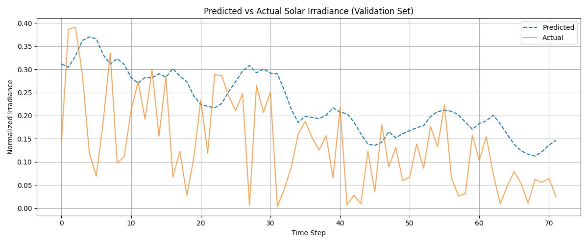

### 🌞 SolarIQ — ML-Powered Solar Forecasting App

🌐 [**Live Demo on Vercel**](https://solariq-hia5u3ngn-khushi-jains-projects-02216216.vercel.app/) (Frontend) | [**Live Backend on Render**](https://solariq.onrender.com/health)

> Forecast daily solar energy generation for your location using weather data from NASA and machine learning.

---

### About the Project

**SolarIQ** is a climate tech product that uses global weather data and time series modeling to:

* Predict next-day solar power output
* Estimate cost savings based on system size and electricity rates
* Provide an easy-to-use interface for homeowners, solar agents, students, and researchers

The backend is a FastAPI application, and the model was trained using PyTorch. The app is deployed on Render.

---

### How It Works

1. **Location Detection**
   - Detects user location using IP (via ipinfo.io) or manual input.

2. **Data**
   - Fetches solar irradiance, temperature, and humidity using the [NASA POWER API](https://power.larc.nasa.gov/).

3. **Processing**
   - Cleans and scales the data.
   - Creates 7-day rolling input sequences for prediction.

4. **Modeling**
   - A trained LSTM-based time series model predicts the next day's solar irradiance.

5. **UI**
   - A modern web interface built with HTML, CSS, and JavaScript allows users to get a forecast and savings estimate.

---

### Sample Output

A snapshot of normalized solar irradiance from NASA POWER API for the past year:


---

### Sequence Generation (Sliding Window)
To prepare data for the LSTM model, SolarIQ uses a sliding window approach:

We take sequences of 7 days of past solar irradiance to predict the irradiance of the next (8th) day.
```
Example:
Input (X):  [Day 1, Day 2, ..., Day 7]
Target (y): Day 8
This method allows the model to learn from historical trends and patterns.
```


---

## Modeling
   - Trains a multi-feature LSTM model using PyTorch.
   - Uses past 7 days of solar irradiance, temperature, and humidity.
   - Predicts the 8th day's irradiance.

---

## Model Performance Visualization

The following graph shows the **predicted vs actual normalized solar irradiance** on the validation dataset:



This plot illustrates how well the trained LSTM model is able to capture patterns in solar irradiance based on features such as temperature, humidity, and past irradiance values.

---

### RMSE (Root Mean Squared Error)

- **Validation RMSE**: `0.1252`
- **Validation MAE**: `0.0996`

The RMSE score measures the average prediction error between actual and predicted irradiance values. A lower RMSE indicates better performance.

---

### Project Structure

```
SolarIQ/
├── main.py                 # FastAPI application
├── requirements.txt        # Python dependencies
├── render.yaml             # Render Blueprint
├── templates/
│   └── index.html          # Web interface
├── static/
│   └── style.css           # Additional styles
├── models/
│   └── solar_lstm.pth      # Trained model
├── backend/                # Backend modules
└── ...
```

---

### Tech Stack

* **Backend**: Python, FastAPI
* **Frontend**: HTML, CSS, JavaScript, Bootstrap
* **ML**: PyTorch, Pandas, NumPy
* **APIs**: NASA POWER API, ipinfo.io
* **Deployment**: Vercel (Frontend), Render (Backend), GitHub

---

### Built by

**Khushi Jain** — Climate tech enthusiast

---
